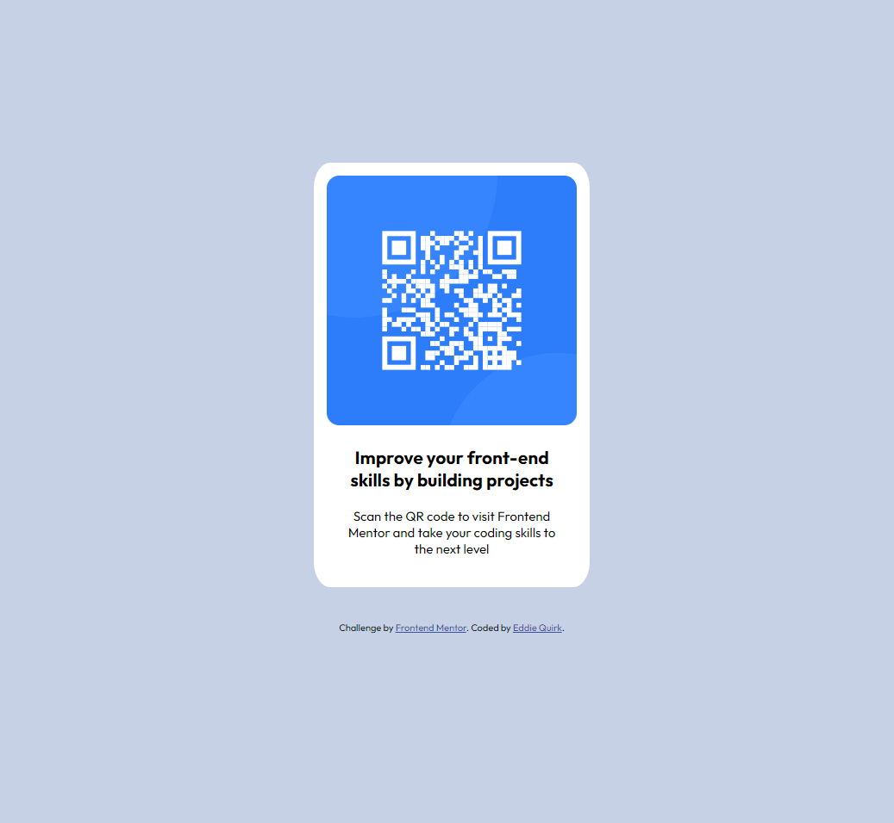

# Frontend Mentor - QR code component solution

This is a solution to the [QR code component challenge on Frontend Mentor](https://www.frontendmentor.io/challenges/qr-code-component-iux_sIO_H). Frontend Mentor challenges help you improve your coding skills by building realistic projects. 

## Table of contents

- [Overview](#overview)
  - [Screenshot](#screenshot)
  - [Links](#links)
- [My process](#my-process)
  - [Built with](#built-with)
  - [What I learned](#what-i-learned)
  - [Continued development](#continued-development)
- [Author](#author)
- [Acknowledgments](#acknowledgments)

**Note: Delete this note and update the table of contents based on what sections you keep.**

## Overview

### Screenshot



### Links

- Solution URL: [Github Repository](https://github.com/edquirk/qr-code-component-main)
- Live Site URL: [Live Site](https://edquirk.github.io/qr-code-component-main/)

## My process

### Built with

- HTML5 markup
- CSS custom properties
- Responsive

### What I learned

I learned more than anything about Universal Selectors and how they effect different elements.  Thanks to some mentors on Frontend I was able to use some of it for this project.  I also learned more about Version Control and how to synchronize VS code with GitHub.

```css
* {
  margin: 0;
  padding: 0;
  box-sizing: border-box;
  font-family: "Outfit", sans-serif;
}
```

### Continued development

I would like to do the next challenge possibly using Flexbox or CSS Grid as I recently learned about this area of CSS.

## Author

- Website - [Eddie Quirk](TBD)
- Frontend Mentor - [@edquirk](https://www.frontendmentor.io/profile/edquirk)
- Linkdin - [Eddie Quirk](https://www.linkedin.com/in/eddie-quirk/)

## Acknowledgments

Thank you to @James for helping with a few things on the Frontend Slack channel!
